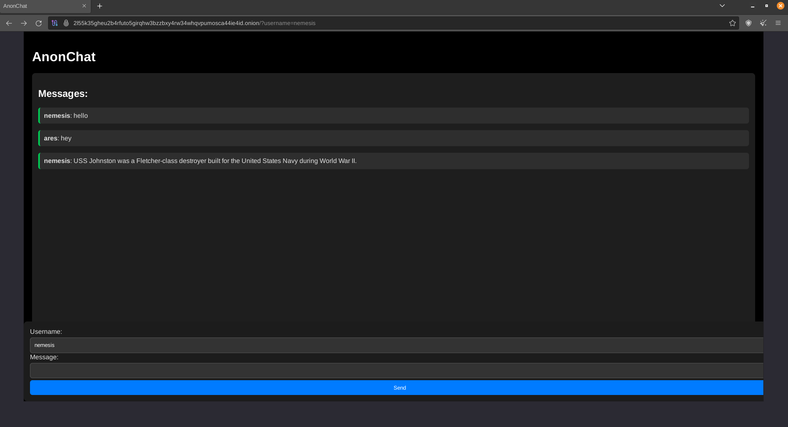

# AnonChat
## An anonymous web chat server written in Rust
<!-- DESCRIPTION -->
## Description:

Anonymous chat provides significant benefits for cybersecurity by enhancing user privacy and security in digital communications. It allows individuals to engage in discussions without revealing their identities, which can help protect them from potential threats such as stalking, harassment, or doxxing. By masking personal information, anonymous chat reduces the risk of targeted attacks and data breaches, making it difficult for malicious actors to exploit user identities.

<!-- FEATURES -->
## Features:

- Small codebase

- No JavaScript

- I2P and Tor support

- Rate-limiting

- Docker support

- Written in Rust

<!-- INSTALLATION -->
## Installation:

    sudo apt update
    sudo apt install curl build-essential rustc
    git clone https://github.com/umutcamliyurt/AnonChat.git
    cd AnonChat/
    sudo cargo build
    sudo cargo run

<!-- DEMO -->
## Demo:

```
$ sudo cargo run
    Finished `dev` profile [unoptimized + debuginfo] target(s) in 0.13s
     Running `target/debug/anon_chat`
🔧 Configured for debug.
   >> address: 0.0.0.0
   >> port: 80
   >> workers: 6
   >> max blocking threads: 512
   >> ident: Rocket
   >> IP header: X-Real-IP
   >> limits: bytes = 8KiB, data-form = 2MiB, file = 1MiB, form = 32KiB, json = 1MiB, msgpack = 1MiB, string = 8KiB
   >> temp dir: /tmp
   >> http/2: true
   >> keep-alive: 5s
   >> tls: disabled
   >> shutdown: ctrlc = true, force = true, signals = [SIGTERM], grace = 2s, mercy = 3s
   >> log level: normal
   >> cli colors: true
📬 Routes:
   >> (index) GET /?<username>
   >> (send) POST /send
📡 Fairings:
   >> Shield (liftoff, response, singleton)
🛡️ Shield:
   >> Permissions-Policy: interest-cohort=()
   >> X-Content-Type-Options: nosniff
   >> X-Frame-Options: SAMEORIGIN
🚀 Rocket has launched from http://0.0.0.0:80
```

<!-- SCREENSHOT -->
## Screenshot:



<!-- LICENSE -->
## License

Distributed under the MIT License. See `LICENSE` for more information.
