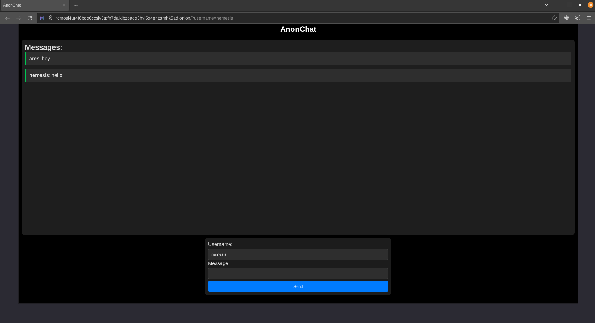

# AnonChat
## An anonymous and amnesic web chat server written in Rust
<!-- DESCRIPTION -->
## Description:

Anonymous chat provides significant benefits for cybersecurity by enhancing user privacy and security in digital communications. It allows individuals to engage in discussions without revealing their identities, which can help protect them from potential threats such as stalking, harassment, or doxxing. By masking personal information, anonymous chat reduces the risk of targeted attacks and data breaches, making it difficult for malicious actors to exploit user identities.

<!-- FEATURES -->
## Features:

- Small codebase

- No JavaScript

- All chat data is stored in RAM

- I2P and Tor support

- Docker support

- Written in Rust

<!-- INSTALLATION -->
## Standard Installation:

    sudo apt update
    sudo apt install curl build-essential rustc git
    git clone https://github.com/umutcamliyurt/AnonChat.git
    cd AnonChat/
    sudo cargo build
    sudo cargo run

## Docker:
    
    sudo apt update
    sudo apt install docker.io git
    git clone https://github.com/umutcamliyurt/AnonChat.git
    cd AnonChat/
    docker build -t anonchat:latest .
    docker run -p 80:80 anonchat:latest

<!-- SCREENSHOT -->
## Screenshot:

<!-- LICENSE -->
## License

Distributed under the MIT License. See `LICENSE` for more information.
